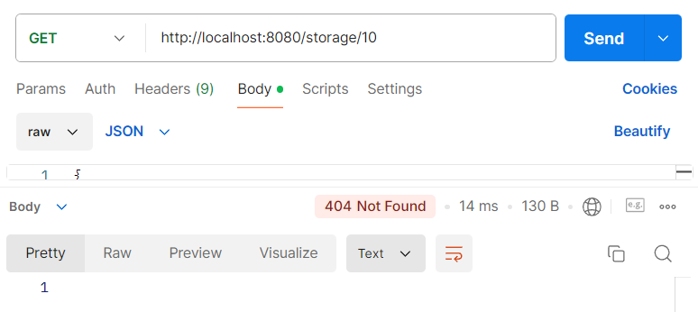

Для реализации данной задачи был создан класс Storage, который представляет собой основной класс 
микросервиса для хранения файлов и их атрибутов. При описании класса использовал библиотеку lombok.

Интерфейс StorageRepository был создан на основе JpaRepository для взаимодействия с базой данных PostgreSQL.

Контроллер FileStorageController реализует API-методы, необходимые для работы с файлами. 

Для пагинации и сортировки используется PageRequest

Для контроллера написаны тесты в классе FileStorageControllerTest

Программу запускаю локально в IntelliJ IDEA используя базу данных file_storage

## Создание файла

## Получение файла

## Получение списка всех файлов с сортировкой по убыванию времени и пагинацией по 5 элементов

Для пустой БД

## Результаты прохождения тестов

